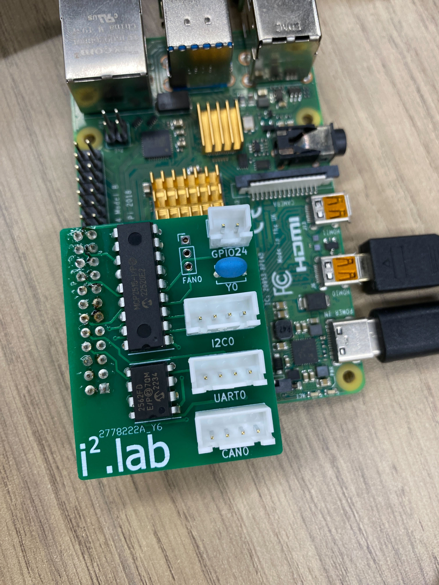

# ハードウェア
<br>
- 回路図  
<br>

# 端子
## CAN
### 使用したもの
- [MCP2515(コントローラ)](https://akizukidenshi.com/catalog/g/gI-12030/)
  CANプロトコルをSPIに変換するため．[外部クロック](https://akizukidenshi.com/catalog/g/gP-00147/)が必要(夢考房にあるやつ)
- [MCP2562FD(トランシーバ)](https://akizukidenshi.com/catalog/g/gI-14383/)
  物理層

### 起動ファイル
ラズパイOSでは`/boot/config.txt`．Ubuntuでは`/boot/firmware/config.txt`，同ディレクトリの`usercfg.txt`(推奨)に以下を追記．
```bash
# enable MCP2515
dtparam=spi=on
dtoverlay=mcp2515-can0,oscillator=20000000,interrupt=25
dtoverlay=spi-bcm2835
```
`oscillator=`は外部クロックに合わせる．`interrupt=`は配線したGPIOを指定．  
書き終わったらreboot!

#### 確認
```bash
$ dmesg | grep -e CAN -e can
[    -] CAN device driver interface
[    -] mcp251x spi0.0 can0: MCP2515 successfully initialized.
```
みたいに返ってくればOK．

### 有効化
デバイスの状態をUPにする．
```bash
sudo ip link set can0 type can bitrate 1000000
sudo ip link set can0 up
```
ビットレートは環境に合わせて変更．->`ifconifg`にCAN0が出てくるはず．

### 受信
CANパケットを[candump](http://manpages.ubuntu.com/manpages/bionic/man1/candump.1.html)で確認する．  
`candump can0 -x`  

```bash
can0  RX - -  000   [8]  00 00 00 00 00 00 00 00
```
などと表示されれば成功．

あとは`socketcan_if`などのパッケージでlinux-canで触ってみる．


## UART
GPIO14(TXD0), GPIO15(RXD0)とつなげただけ．  
GND | +5V | TX | RX

## I2C
GPIO2(SDA1), GPIO3(SDL1)とつなげただけ．  
GND | +5V | SDA | SCL

## GPIO24
制御緊急停止用．  
GND | GPIO24

## FAN
ファンコントロールのためのGPIO． ラズパイコンフィグから指定．  
GND | +5V | GPIO18
